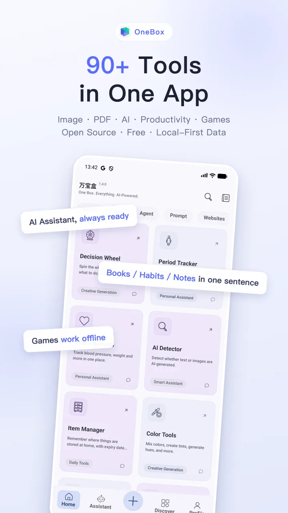
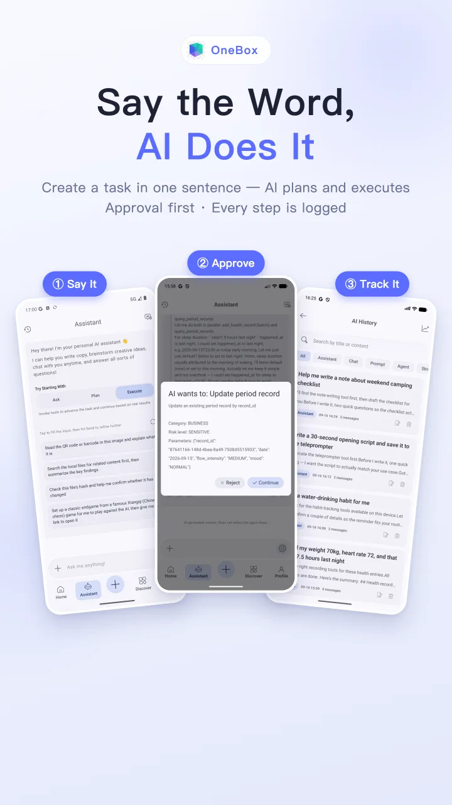
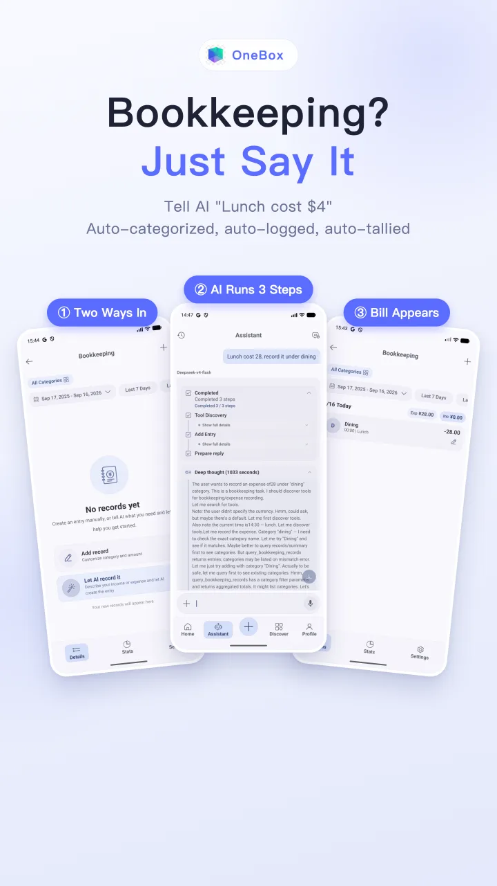
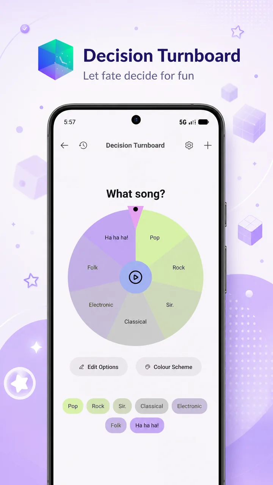
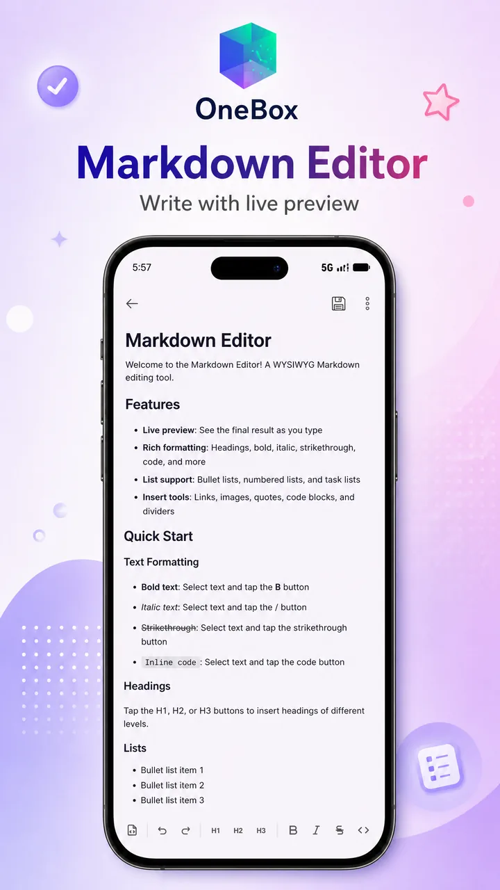
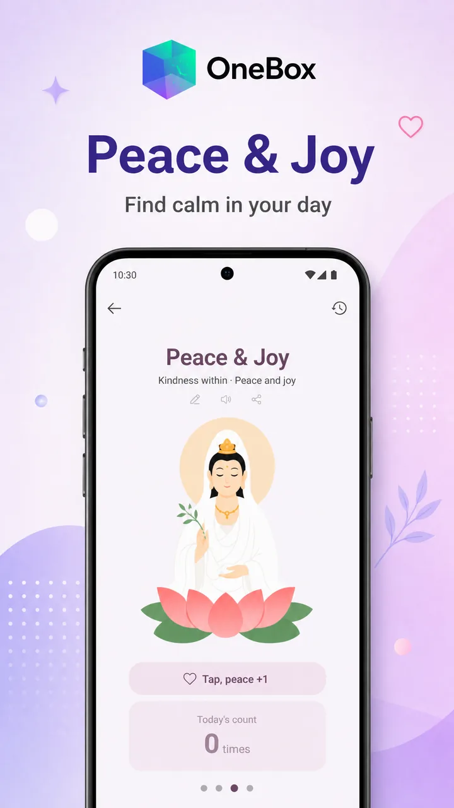
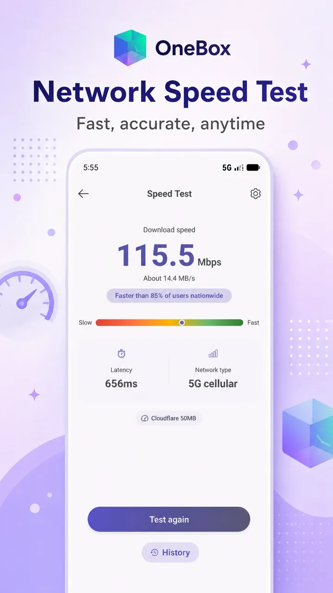
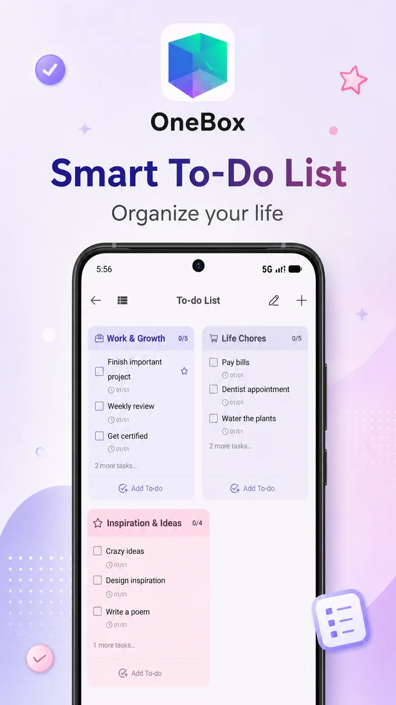

<div align="center">
  

  # OneBox (万宝盒)

  **English** | [简体中文](README.zh-CN.md)

  A free AI-agent toolbox for Android: say what you need and the built-in agent drives
  90+ in-app tools to get it done — plus image & document tools, productivity and daily utilities.

  [](LICENSE)
  [](https://play.google.com/store/apps/details?id=com.shifenmiao.app)
</div>

## Screenshots

<table>
  <tr>
    <td></td>
    <td></td>
    <td></td>
    <td></td>
  </tr>
  <tr>
    <td></td>
    <td></td>
    <td></td>
    <td></td>
  </tr>
</table>

## Download

- **International**: [Google Play](https://play.google.com/store/apps/details?id=com.shifenmiao.app) · [Official site](https://www.oneboxable.com)
- **中国大陆**: [万宝盒官网](https://www.wanbaohe.com) · 小米 / 应用宝 / OPPO / vivo / 华为应用商店搜索「万宝盒」

## AI Assistant: More Than Just Feature Count

Plenty of toolbox apps are long on features. OneBox's built-in AI assistant saves you from hunting for tools and memorizing steps — just say what you want:

> "Turn these images into a PDF."
> "Log this bill screenshot into my ledger."
> "Make me a to-do list."
> "Look up today's stock prices online."

It understands, acts, and reports back — in one flow.

- **Bounded by its own permissions**: everything the agent does stays inside the app's own Android sandbox and declared permission set — it never touches contacts, SMS or call logs; local tools run entirely on-device, and only the conversation with your chosen model goes online.
- **An agent that drives the tools**: the AI agent can invoke 90+ in-app local tools (PDF processing, image editing, file management, bookkeeping…), chaining multi-step tasks across tools — executed locally with per-tool timeouts and iteration limits.
- **Picture-in-picture robot, no more waiting around**: long agent task? Just leave the app — with an active AI session it drops into system picture-in-picture, where the mini-window robot keeps you posted on progress and one tap brings you back to the result. Native PiP, zero permissions required.
- **One chat, many models**: talk to multiple mainstream LLMs from a single entry, with custom AI engines and prompt management.
- **Bring your own keys**: configure third-party API keys and pick any model provider — even free APIs — extending AI capabilities at zero cost.
- **Transparent by source**: every line is public — how data is processed locally and what never leaves the device is something you can verify, not a promise you have to trust.

## Features

- **Image & media tools**: crop, collage, filters, background removal, format conversion, EXIF editing, document scanning, QR scanning, and more.
- **AI capabilities**: AI chat, agent tool-calling, AI image features, with configurable local/remote AI engines.
- **Productivity & daily tools**: file browser, file transfer, Markdown editor, notes/to-do, calendar, bookkeeping, unit converter, teleprompter, and more.
- **Adaptive top-level navigation**: drawer + bottom bar in portrait, navigation rail in landscape; the shell and global state are orchestrated by `feature/app`.

## Tech Stack

- **UI**: Jetpack Compose, Material 3
- **Navigation / components**: Decompose (`StackNavigation`, `childStack`, retained components)
- **DI**: Hilt
- **Code generation**: KSP
- **Build conventions**: custom Gradle convention plugins in `build-logic/convention`
- **Persistence**: SQLite / Room (`AppDatabase`), MMKV (per-module)
- **Network & images**: Retrofit / OkHttp, Coil

## Repository Structure

| Path | Description |
| --- | --- |
| `app/` | Application shell and packaging entry; `AppActivity.kt` is the main Activity |
| `feature/app/` | Top-level shell, root navigation, global CompositionLocals, screen wiring, adaptive layout |
| `feature/*` | Business / tool feature modules |
| `feature/ai/` | AI chat, agent, tool-calling chain, AI image features |
| `feature/common/` | Shared business logic, AI engine catalog/sync |
| `feature/settings/` | Settings, themes, AI engine & working-model configuration |
| `core/*` | Foundation layers: UI, domain, data, database, theme, settings, etc. |
| `libs/*` | In-project reusable libraries |
| `build-logic/convention/` | Custom Gradle convention plugins |
| `web/` | Web frontend source of the file-transfer module (esbuild project) |
| `fastlane/` | Google Play listing copy & assets (fastlane supply format) |

## Architecture Entry Points

- **App entry**: `app/src/main/java/com/shifenmiao/app/AppActivity.kt`
- **Runtime navigation root**: `feature/app/src/main/java/com/t8rin/imagetoolbox/feature/root/presentation/screenLogic/RootComponent.kt`
- **Route definitions**: `core/ui/src/main/kotlin/com/t8rin/imagetoolbox/core/ui/utils/navigation/Screen.kt`
- **Child factory wiring**: `feature/app/.../navigation/ChildProvider.kt`
- **Child composable wrappers**: `feature/app/.../navigation/NavigationChild.kt`
- **Top-level shell selector**: `feature/app/src/main/java/com/wanbaohe/app/screen/ScreenSelector.kt`
- **Adaptive navigation layout**: `feature/app/src/main/java/com/wanbaohe/app/navigation/AdaptiveNavigationLayout.kt`

## Building from Source

### Requirements

- Use the bundled **Gradle Wrapper 9.5.1**
- **JDK 17** (build-logic and CI target it)
- Android targets: **Compile SDK 37 / Target SDK 37 / Min SDK 24**
- Toolchain: **Kotlin 2.4.0 / AGP 9.3.0**
- When in doubt, `gradle/libs.versions.toml` and `gradle/wrapper/gradle-wrapper.properties` are the source of truth

### Common Commands

```bash
./gradlew :app:assembleOneboxUniversalDebug   # single-variant debug APK
./gradlew tasks --group=assemble              # list all assemble tasks
./gradlew :app:tasks
```

### Variants

The `app` module uses two flavor dimensions:

- `app`: `xiaomi` / `yyb` / `oppo` / `vivo` / `huawei` / `onebox` / `google`
- `abi`: `arm64` / `arm32` / `universal`

Task names combine them, e.g.:

- `:app:assembleHuaweiArm64Debug`
- `:app:installOneboxUniversalDebug`

See `run.md` for more command examples.

### Signing & API Keys (Optional)

The project syncs and builds **without any key files**:

- release signing falls back to placeholder values (not for production use)
- debug builds fall back to AGP's default debug signing
- third-party service keys (AI providers, Google Places, etc.) are empty and the corresponding features stay disabled

To customize, copy the root templates and fill in real values:

- `keystore.properties.template` → `keystore.properties`: release signing + service keys
- `keystore-google.properties.template` → `keystore-google.properties`: dedicated signing for the google flavor

Both target files are git-ignored; never commit real values.

### Multi-channel Release Builds

`build_release.sh` builds **6 channels × 2 ABIs (arm64 / arm32) = 12 release APKs** into `release/` with a `release/manifest.txt` summary. Examples:

```bash
./build_release.sh                                # all 12
./build_release.sh --channel xiaomi huawei        # selected channels
./build_release.sh --abi arm64                    # 64-bit only
./build_release.sh --no-offline --clean           # fetch deps online + clean first
./build_release.sh --skip-build                   # re-collect artifacts only
```

A real `keystore.properties` is required for release packaging (the script exits early without it).

### CI Releases

`.github/workflows/android.yml` defines the tag-based release pipeline: Ubuntu runner, JDK 17, `assembleRelease`, then APK signing and release upload.

## AI / Agent Capabilities

AI features are composed from several modules:

- `feature/ai/`: AI chat, agent loop, tool-call execution, interactive tool bridging
- `feature/common/`: AI engine catalog, engine sync, shared managers
- `feature/settings/`: AI engine, model and working-mode configuration UI

The tool-calling chain is built on `ToolCallTaskManager`, `AgentLoopExecutor` and `AppDatabase`.

## Security & Third-party Services

- **No production secrets in this repo**: payment (WeChat Pay / Alipay), AI provider and Google Places keys are injected via the optional `keystore.properties` or kept server-side.
- **Backend domains and guest tokens are not in source**: API base URLs and read-only guest tokens are injected from `keystore.properties` at build time, so builds from this repository never contact the production servers and hosted content stays empty. To enable connected features, point the app to your own backend (`core/r/**/UrlConstantsFlavor.kt`).
- **WeChat appId / WeCom corpId** are public identifiers; the WeChat platform verifies callers by package name + signature, so third-party builds cannot impersonate the official app.
- **Forks & redistribution**: change the `applicationId` (`com.shifenmiao.app` is taken), replace `app/src/google/assets/google-services.json` with your own Firebase configuration, and point the app to your own backend (API domains in `core/r/**/UrlConstantsFlavor.kt`).

## Documentation

- `run.md`: build / install / lint commands
- `docs/modules.md`: module catalog (Chinese)
- `CONTRIBUTING.md`: contribution guidelines

## License

Apache-2.0, see `LICENSE`. This project is built on [ImageToolbox](https://github.com/T8RIN/ImageToolbox) (T8RIN, Apache-2.0); upstream copyright notices are preserved in source files.
